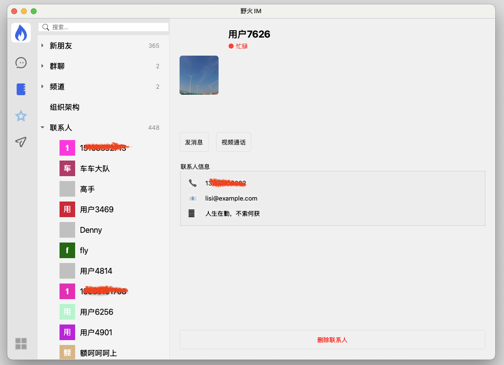

## 野火IM解决方案

野火IM是专业级即时通讯和实时音视频整体解决方案，由北京野火无限网络科技有限公司维护和支持。

主要特性有：私有部署安全可靠，性能强大，功能齐全，全平台支持，开源率高，部署运维简单，二次开发友好，方便与第三方系统对接或者嵌入现有系统中。详细情况请参考[在线文档](https://docs.wildfirechat.cn)。

主要包括一下项目：

| [GitHub仓库地址(主站)](https://github.com/wildfirechat)            | [码云仓库地址(镜像)](https://gitee.com/wfchat)                | 说明                                                             | 备注                      |
|--------------------------------------------------------------|-------------------------------------------------------|----------------------------------------------------------------|-------------------------|
| [im-server](https://github.com/wildfirechat/im-server)       | [im-server](https://gitee.com/wfchat/im-server)       | IM Server                                                      |                         |
| [android-chat](https://github.com/wildfirechat/android-chat) | [android-chat](https://gitee.com/wfchat/android-chat) | 野火IM Android SDK源码和App源码                                       | 可以很方便地进行二次开发，或集成到现有应用当中 |
| [ios-chat](https://github.com/wildfirechat/ios-chat)         | [ios-chat](https://gitee.com/wfchat/ios-chat)         | 野火IM iOS SDK源码和App源码                                           | 可以很方便地进行二次开发，或集成到现有应用当中 |
| [pc-chat(electron)](https://github.com/wildfirechat/vue-pc-chat)       | [pc-chat(electron)](https://gitee.com/wfchat/vue-pc-chat)       | 基于[Electron](https://electronjs.org/)开发的PC 端                   |                         |
| [pc-chat(Qt)](https://github.com/wildfirechat/qt-pc-chat)       | [pc-chat(Qt)](https://gitee.com/wfchat/qt-pc-chat)       | 基于Qt开发的PC 端                   |                         |
| [web-chat](https://github.com/wildfirechat/vue-chat)         | [web-chat](https://gitee.com/wfchat/vue-chat)         | 野火IM Web 端, [体验地址](http://web.wildfirechat.cn)                 |                         |
| [wx-chat](https://github.com/wildfirechat/wx-chat)           | [wx-chat](https://gitee.com/wfchat/wx-chat)           | 小程序平台的Demo(支持微信、百度、阿里、字节、QQ 等小程序平台)                            |                         |
| [app server](https://github.com/wildfirechat/app_server)     | [app server](https://gitee.com/wfchat/app_server)     | 应用服务端                                                          |                         |
| [robot_server](https://github.com/wildfirechat/robot_server) | [robot_server](https://gitee.com/wfchat/robot_server) | 机器人服务端                                                         |                         |
| [push_server](https://github.com/wildfirechat/push_server)   | [push_server](https://gitee.com/wfchat/push_server)   | 推送服务器                                                          |                         |
| [docs](https://github.com/wildfirechat/docs)                 | [docs](https://gitee.com/wfchat/docs)                 | 野火IM相关文档，包含设计、概念、开发、使用说明，[在线查看](https://docs.wildfirechat.cn/) |                         |

野火IM QT Demo。

## 前置说明
1. 本项目所使用的`PC SDK`是需要付费的，价格请参考[费用详情](https://docs.wildfirechat.cn/price/)
2. `PC SDK`支持试用，具体请看[试用说明](https://docs.wildfirechat.cn/trial/)
3. 本项目默认只能连接到官方服务，购买或申请试用之后，替换`PC SDK`，即可连到自行部署的服务

## 环境依赖
1. 此应用是基于QT5编写，可以同时支持QT5和QT6。对QT5的支持更好一些，QT5.15支持Windows7及以上系统，QT5.6可以支持到WindowsXP（5.6因为没有验证环境，还需进一步验证）。
2. 如果目标系统不包括Windows7及以下系统，可以选择使用QT6。使用QT6时需要做一些测试，把遗漏未兼容的地方做一下修改。

## 支持平台
1. Windows平台，可以稳定支持到Windows7及以上系统。WindowsXP也可以尝试。
2. Mac平台，支持X86和苹果芯片。
3. Linux系统，支持常见linux系统，比如Ubuntu等。支持Intel/AMD及Arm芯片。
4. 国产化系统。支持所有国产化linux系统。支持所有国产化CPU。

## 替换SDK
默认SDK是连接野火的测试环境，直接编译运行，可以扫码或者验证码登录。如果购买或者试用，会发给客户绑定客户IM服务的SDK。替换默认的SDK，路径在[src/wfc/proto](./src/wfc/proto)，按照系统和架构替换默认SDK。另外修改配置文件[config.cpp](src/config.cpp)中的应用服务地址。

## 开发
此项目仅为demo水平，还有大量的功能缺失和UI错误，客户可以自己来继续开发，SDK功能是完善的，如果有缺失也可以联系我们添加。也非常欢迎给我们提交代码。需要有一定QT研发能力的客户才可以使用此项目。

## 音视频
暂不支持音视频通话。可能会很长期不会添加这个功能，如果对音视频功能有强需求的客户慎重考虑，可以选择基于electron的应用。

## 软件截图
登录：

主窗口：

聊天界面：

联系人界面：

## 第三方库
项目中使用了如下第三方项目：
1. [ezviewer](./src/vendor/ezviewer) 用来显示图片。
2. [qrcode](./src/vendor/qrcode) 用来显示二维码。
3. [zenshot](./src/vendor/zenshot) 用来截图。

对他们的开源表示感谢～

## License
此项目野火要求是MIT License。但此项目是基于QT开发，还需要同时满足QT的License，即：要么按照QT的要求开源，要么购买QT的授权（这是QT的要求，与野火无关）。
